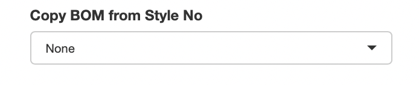

# Bill of Materials

Each Product ID has its own Bill of Materials (BOM).

To open a BOM click on the <i class="fa fa-pencil-square"></i> icon against the said Product ID on the Product List tab. This would open a new browser tab, where the BOM can be created / edited for the given Product ID.

Once the new browser tab / window is opened it will show three tabs on the page.

1.  Header
2.  Bill of Materials
3.  COE Jobs

{width="50%"}

## Header

The header tab shows the header level details against the Product ID, which can be modified on this tab if required. All of the fields shown on the header tab are also available to update from the Product List tab on the main screen.

### Product Lock / Unlock

There is a button provided here to Lock / Unlock Product BOM. This functionality is the same as explained under [Product List](#Locking%20/%20Unlocking%20Product%20BOM(s)) with only one difference that it works only for the currently opened BOM.

### Size Set

There is a section given to Add / Remove Sizes and Base Sizes.

#### Adding Sizes

To add Sizes, type in the Sizes you wish to add separated by comma(,) and click on the Add button.

{width="100%"}

#### Removing Sizes

To remove Sizes, type in the Sizes you wish to remove separated by comma(,) and click on the Remove button.

{width="100%"}

#### Size Sequence

Over 20,000 sizes have already been registered in the system in the correct sequence from smallest to largest. Irrespective of whichever sequence one adds the sizes, after 'Saving', the sequences will get automatically corrected to show the smallest size first and the largest at the end.

In case if there are any new sizes which do not appear in the correct sequence, then please get in touch with the IT team to add those sizes into the Standard Size list.

## Bill of Materials

Bill of Materials tab is the place where individual Raw Material items can be added / amended / removed.

***Please note: After adding / updating the BOM, please do not forget to 'Save'***

### Creating / Modifying BOM Line Items

To create / modify BOM line item(s), there two possible methods

1.  By typing on the Excel-like grid on the screen

    Just like excel, type in or copy-paste from another source into the excel-like grid on the screen to update line items. If you wish to add more rows, go to the last row and press 'Enter' or right-click on the one of the row numbers and click on 'Add new Row Before' or 'Add new Row after' button.

2.  By uploading an Excel file

    {width="100%"}

    On the screen, there is a 'Download Excel' button which downloads the BOM in Excel format.

    Once downloaded, one can add / amend the required line items on the downloaded excel file.

    Update the new line items or modify existing ones on the BOM excel file and then upload it into the system using the 'Upload BOM Excel' option.

    Few points to note when adding / amending line items on the Excel file

    -   Do not change column names

    -   Do not add new rows above the header row

    -   Make sure Product ID column is updated with the correct Product ID. Do not leave the Product ID blank

    -   To add new line items, leave the Item ID blank

    -   To amend existing items, ensure that Item ID is not blank

    -   Do not change the Item ID, it is a system generated number

### Removing BOM Line Items

To remove BOM line items, two possible methods can be used

1.  On the screen

    On the BOM grid, make the line item you wish to remove 'blank' and then press 'Save' button. This would remove the BOM item.

2.  Using Excel upload

    On the downloaded excel, make the lien item you wish to remove 'blank', only leaving the Product ID and the Item ID columns filled. Then upload the excel file and 'Save' to remove the said line item.

### Size Dependency Mapping

Size Dependency can be mapped against each line item, if required.

To map the Size Dependency against any item, first mark the Size Dependency column against that line as 'TABLE'.

Once Size Dependency is updated as Table, Sizes can be mapped by

-   Typing into the 'Garment Size' column, separated by comma(,)

-   Marking in the Size Dependency grid located below the BOM grid on the screen

-   Size Dependency can also be updated in Excel and uploaded as part of the BOM

Please note: System will only allow to map any Sizes which have been added on the Size Set.

### Destination Mapping

Destinations can be mapped against each line item, if required.

To map the Destinations against any item, first mark the 'Destination Spec' column against that line as 'Yes'.

Once Destination Spec is updated as 'Yes', Destinations can be mapped by

-   Typing into the 'Destination' column, separated by comma(,)

-   Marking in the 'Destination Mapping' grid located below the BOM grid on the screen

-   Destinations can also be updated in Excel and uploaded as part of the BOM

Please note: System will only allow to map any Destinations which are available on the WFX system. If typing, make sure to type the spellings exactly as defined in WFX.

### Process Items

To specify Process Items on the BOM...

1.  Create the 'Final' RM Item on the BOM and note the 'Item ID' of the final RM Item
2.  Add the process items as regular line items on the BOM
3.  Against the process items, on the 'Req for Item' column, update the 'Item ID' of the Final Item, hence linking them together
4.  Make sure to update the required columns such as Process Type, Process Rate etc.
    -   On the Process Type column, make sure the WFX 'Process Code' is also added

Process Items' mapping can also be done using the Excel upload file.

### Copying BOM from Another Product

Most of the times, Customers place orders for multiple colors for each Style. Since the BOM(s) for each color has only very few differences, it is quite helpful to be able to copy BOM(s) from one Product ID to another.

To copy a BOM

1.  Open the BOM for the Product ID to which you wish to copy

2.  Then from the 'Copy BOM from Style No' drop down select the Style-Season-Color from which you wish to copy the BOM

    {width="347" height="72"}

3.  Once selected, click on the Copy button

    {width="70"}

4.  After this, make the required changes to the BOM and press 'Save'

## COE Jobs

COE Jobs tab provides the facility to be able to easily send jobs to the COE team for Style + Cost Sheet creation or for Cost Sheet Amendment.

### BOM Pre-Validation

Before any job is sent to COE, the application Pre-Validates the data being sent to COE. If there are any discrepancies found those will be listed on the screen and a job will not be sent to COE.

### Sending Job to COE

To send a job to COE, simply click on the 'Send BOM to COE' button.

If it is the first job against the Product ID, a 'Style+Cost Sheet Creation' job will be sent.

If it is not the first job, then a 'Cost Sheet Amendment' job will be sent.

Further, system also detects whether there were any changes made against the Product ID after sending the Previous Job to COE. If there were no changes recorded, then the system will not allow to send a new job to the COE team.

{width="516"}

### Cancelling Job

The latest Job sent to the COE team can be cancelled using this screen, if the Job Status is 'Pending Approval'.

If the Job Status is anything other than 'Pending Approval', that job cannot be cancelled.

### Error Correction

On the COE Job Tracker, there is a job status 'Error Correction'. COE team can mark the job as 'Error Correction'. If the latest job sent against a Product ID is marked as 'Error Correction', when the 'Send BOM to COE' button is clicked, it would not send a new job to COE, but would rather amend the existing job adding a revised attachment to the same.
