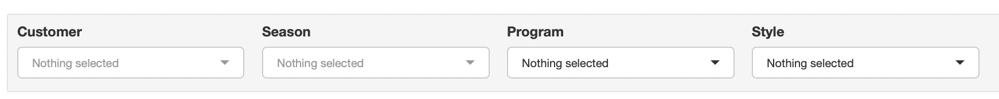

# Pattern Details

Pattern Details tab is to update the details such as Pattern Name, Cut Pc, Fabric Code, Fabric Way, Matching Required and Garment Way.

This option is added into the application to provide visibility to the Cost Engineering team when calculating and updating the Bulk Fabric YY.

Pattern details can be updated against each unique Fabric Item against a Style.

## Filters

Pattern Details tab allows the users to filter based on

{width='100%'}

1.  Customer
2.  Season
3.  Program
4.  Style

## Updating Pattern Details

To update Pattern Details

1.  Select a Customer
2.  Select a Season
    -   All the Fabric items will get listed for all the Styles within the Season
3.  Apply any further filters as and when necessary
4.  Update the Pattern Details by
    -   Typing into the excel-like grid on the screen

        OR

    -   Download the details into excel by clicking on the 'Download' button

    -   Update the Pattern Details in Excel and Save the excel file

        -   Make sure not to remove the Product ID and Item ID on the excel file

    -   Upload the Excel file back into the screen
5.  Press the 'Save' button to Save the updated information
