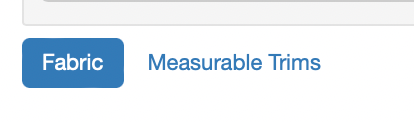
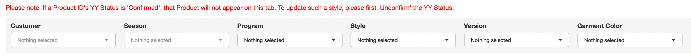
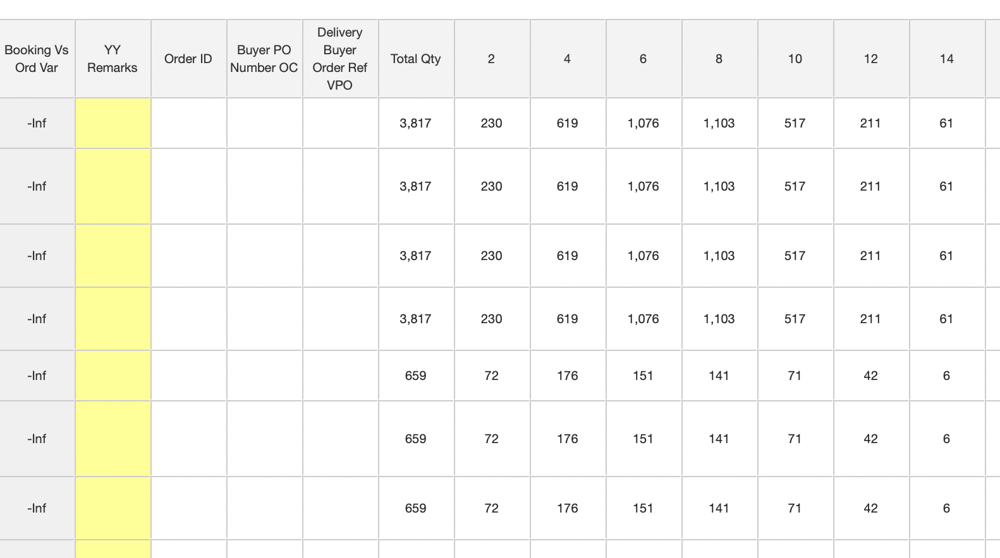
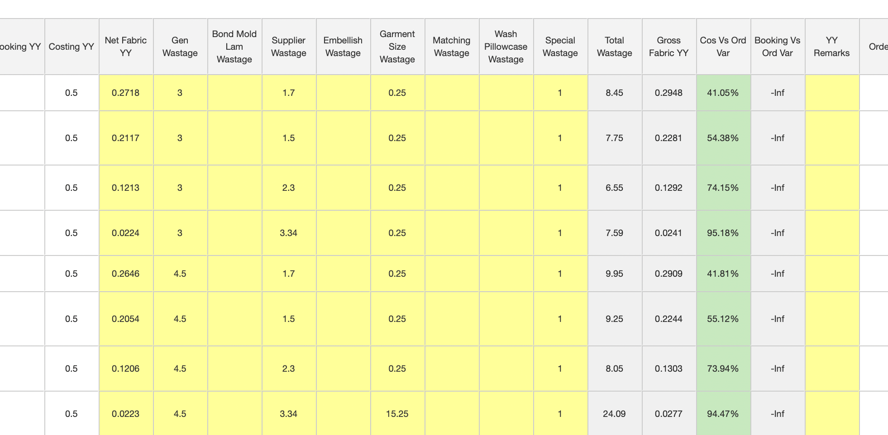
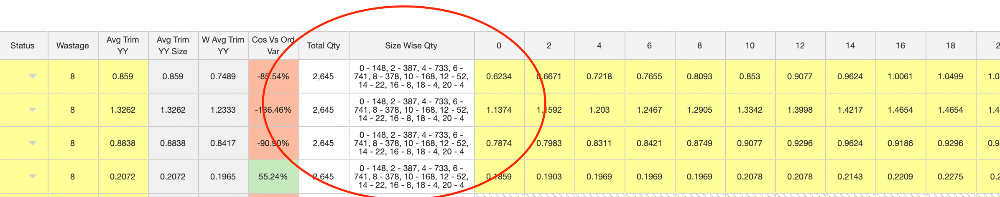
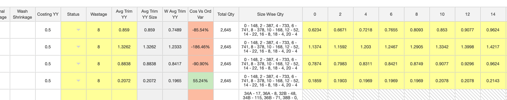

# Bulk YY

The Bulk Cons tab is designed to provide consolidated information for the Cost Engineering team, for the inputs given by the Merchants and Pattern Makers.

-   Development Merchants prepare the BOM

-   Bulk Merchants upload the OrderBook

-   Pattern Makers update the Pattern Details


```{=html}
<div id="htmlwidget-86858fe71d1e2ba69895" style="width:672px;height:250px;" class="grViz html-widget"></div>
<script type="application/json" data-for="htmlwidget-86858fe71d1e2ba69895">{"x":{"diagram":"digraph {\n  graph [layout = dot, rankdir = LR]\n  \n  node [shape = rectangle]        \n  rec1 [label = \"Update BOM\n(Dev Merchant)\"]\n  rec2 [label = \"Upload Orderbook\n(Bulk Merchant)\"]\n  rec3 [label = \"Pattern Details\"]\n  rec4 [label = \"Update Bulk YY\"]\n  rec5 [label = \"Confirm Bulk YY Update\"]\n  rec6 [label = \"Send Bulk YY Update\nto COE\"]\n  \n  rec1, rec2, rec3 -> rec4 -> rec5 -> rec6\n  \n  }","config":{"engine":"dot","options":null}},"evals":[],"jsHooks":[]}</script>
```

The Bulk Cons tab is further divided into 2 tabs

1.  [Fabric]
2.  [Measurable Trims]

{width="50%"}

## Filters

Bulk Cons tab can be filtered by the following fields

{width="100%"}

1.  Customer
2.  Season
3.  Program
4.  Style
5.  Version
6.  Garment Color

Please note: If Bulk YY has been confirmed for a Product ID, it will not show on this screen. To view such details, either download using the 'Download (incl Confirmed)' button or first 'Unconfirm' the YY for that Product ID from the [COE Jobs] tab.

## How to Update

To update YY details for either Fabric or Trims

1.  Select a Customer
2.  Select a Season
    -   All the Styles created within the Season will get listed
3.  Apply any further filters as and when necessary
4.  Update the details by
    -   Typing into the excel-like grid on the screen

        OR

    -   Download the details into excel by clicking on the 'Download' button

    -   Update the details in Excel and Save the excel file

        -   Make sure not to edit / remove the Product ID and Item ID from the excel

    -   Upload the Excel file back into the screen
5.  Press the 'Save' button to Save the updated information

Please note: Only Yellow highlighted columns are editable.

## Fabric

Fabric tab is designed to update Bulk YY for Fabric items.

For Decathlon, Bulk Fabric YY can be updated by Customer PO.

For all other Customer accounts, the 'Bulk' Orders are combined together to show a total Size-wise requirement against Product ID.

### Information on the Grid

Once a Customer and Season are selected on the filters, all the Product IDs which have Fabric Items on the BOM will get list on the grid below.

1.  Fabric details added by the Development Merchant will be visible, each row representing one BOM line item

{width="100%"}

2.  Pattern Details as updated by the Pattern Makers shall also be visible on the same grid against each Fabric line item

{width="100%"}

3.  Size-wise Quantities from the Bulk Orders updated by the Bulk Merchants shall be visible at the right end side of the grid

{width="100%"}

### Fields to Update

Fields that can be updated by the Cost Engineering team are highlighted in Yellow.

{width="100%"}

<ol> <li> Net Fabric YY </li><li> Gen Wastage </li><li> Bond Mold Lam Wastage </li><li> Supplier Wastage </li><li> Embellish Wastage </li><li> Garment Size Wastage </li><li> Matching Wastage </li><li> Wash Pillowcase Wastage </li><li> Special Wastage </li><li> YY Remarks </li> </ol>

### Calculated Fields

When the required fields are updated, few calculated fields on the screen show the following information.

{width="100%"}

Please see the Grey, Red and Green columns on the above figure.

1.  Total Wastage $$
      Total Wastage = Gen Wastage + Bond Mold Lam Wastage + Supplier Wastage + \\ Embellish Wastage + Garment Size Wastage + Matching Wastage + \\Wash Pillowcase Wastage + Special Wastage + \\Emb Wastage + Residual Shrinkage
    $$

2.  Gross Fabric YY $$
       Gross Fabric YY = Net Fabric YY + (\frac{Total Wastage}{100} * Net Fabric YY)
    $$

3.  Cos Vs Ord Var $$
       Cos Vs Ord Var = \frac{Costing YY - Gross Fabric YY}{Costing YY} * 100
    $$

4.  Booking Vs Ord Var $$
       Booking Vs Ord Var = \frac{Booking YY - Gross Fabric YY}{Booking YY} * 100
    $$

## Measurable Trims

Measurable Trims tab is designed to update Bulk YY for Measurable Trims items or any other Trim Items, as specified by the Development Merchant on the BOM.

On the BOM, there is a column named 'Cons by Size'. If 'Cons by Size' column is checked TRUE, then the specified BOM Line Item will become visible to the Cost Engineering team on the Bulk Cons - Measurable Trims tab grid. Hence, allowing them to update Bulk YY for the same.

For Measurable Sewing Trims, meaning any Sewing Trim item whose WFX Code starts with 'S' and the UOM is MTR or YRD, the 'Cons by Size' column will be checked TRUE automatically, unless manually unchecked and made FALSE by the Development Merchant.

### Information on the Grid

Once a Customer and Season are selected on the filters, all the Product IDs which have Measurable Trim Items on the BOM will get list on the grid below.

1.  Trim item details added by the Development Merchant will be visible, each row representing one BOM line item

{width="100%"}

2.  Total Order Quantity and the Size-Wise Quantity as uploaded by the Bulk Merchants on the [Orderbook] tab will also be show against each line item

{width="100%"}

### Fields to Update

Fields that can be updated by the Cost Engineering team are highlighted in Yellow.

{width="100%"}

1.  Wastage
2.  Avg Trim YY
3.  Size-Wise Trim YY - only for Garment Sizes added to the Product ID

### Calculated Fields

When the required fields are updated, few calculated fields on the screen show the following information.

Please see the Grey, Red and Green columns on the below figure.

{width="100%"}

1.  Avg Trim YY Size

    $$
    Average Trim YY = \frac{sum(Size Wise Trim YY)}{Total Number of Sizes}
    $$

2.  W Avg Trim YY

    $$
    Weighted Average Trim YY = \frac{sum(Size Wise Trim YY * Size Wise Order Qty)}{Total Number of Sizes}
    $$

3.  Ord YY (in background - not visible - only used for Calculation) $$
    Ord YY = (\text{IF Avg Trim YY is blank THEN Avg Trim YY Size ELSE Avg Trim YY}) + \text{Wastage %}
    $$

4.  Cos Vs Ord Var $$
    Cos Vs Ord Var = \frac{Costing YY - Ord YY}{Costing YY} * 100
    $$
