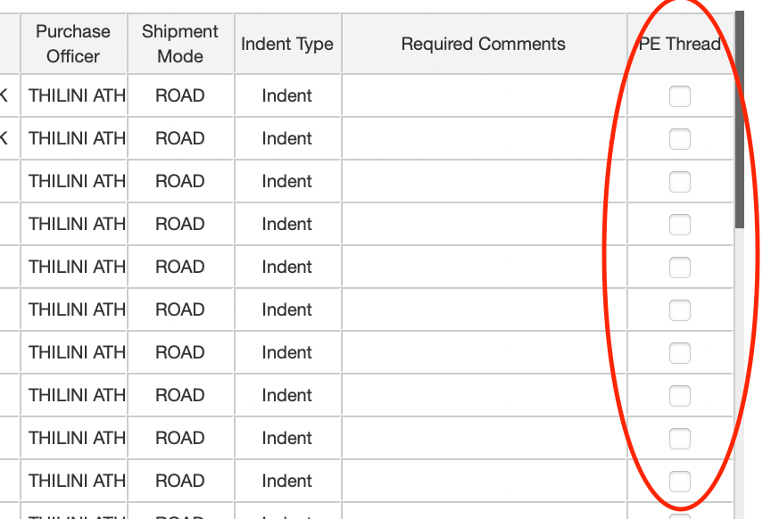
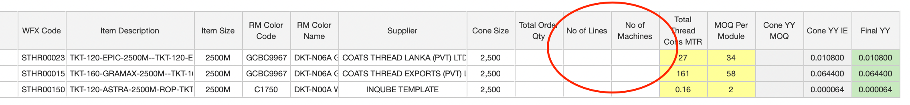

# Thread YY

To update Thread YY, there two different methods defined, one for Lululemon customer account and the second for all others

1.  [Lululemon] - tab on the main screen named 'Thread YY'
2.  [All other Customers] - tab on the main screen named 'Thread YY - IE'

## Lululemon

For the Lululemon account the Thread YY is updated into this system by the Development Merchant.

The 'Thread YY' tab works in a similar way as the [Multiple BOM Editor] tab and allows the users to Add / Update / Remove bom line items.

The differences on the Thread YY tab as compared to the [Multiple BOM Editor] tab are...

-   Thread YY tab only works for Thread items

-   Limited number of BOM columns, ones that are relevant for Thread items

-   Shows the Total Order Quantity as updated on the [Orderbook] tab by the Bulk Merchant - used for YY calculation

-   Merchant can update the No of Cones, YY shall be calculated based on No of Cones and Total Order Qty

    $$
    Thread YY = \frac{\text{No of Cones}}{\text{Total Order Qty}}
    $$

{width="100%"}

### PE Threads

As a custom requirement, there is a feature available on the Thread YY tab to mark selected Thread Line Items as 'PE Thread'.

To update a Thread line item as a PE Thread, there is a column added at the right end of the grid, named 'PE Thread'. Here, one can 'check' or 'un-check' the items.

For any Thread Line item, if PE Thread is marked as checked, then in the background, system changes the following columns on the BOM

-   Destination Spec = Yes

-   Destination = PE Thread

{width="50%"}

### How to Update

To update Thread YY details...

1.  Select a Customer
2.  Select a Season
    -   All the Styles created within the Season will get listed
3.  Apply any further filters as and when necessary
4.  Update the details by
    -   Typing into the excel-like grid on the screen

        OR

    -   Download the details into excel by clicking on the 'Download' button

    -   Update the details in Excel and Save the excel file

        -   Make sure not to edit / remove the Product ID and Item ID from the excel

    -   Upload the Excel file back into the screen
5.  Press the 'Save' button to Save the updated information

If you are not fully clear, please refer to the documentation for [Multiple BOM Editor].

## All other Customers

For all other Customer accounts, Thread YY is updated by the PDC IE team.

For the PDC IE team, a separate tab named 'Thread YY - IE' is available on the main screen.

The 'Thread YY - IE' tab allows the IE team members to update the Thread YY against already added Thread line items on the BOM.

To show any thread on this tab, first the Development Merchant must add the relevant Thread items on the [Bill of Materials].

1.  Add Thread Line Items on the [Bill of Materials] - Development Merchant
2.  Ensure required fields are updated on [Product List] - Development Merchant
3.  Ensure Orders are uploaded on the [Orderbook] - Bulk Merchant
4.  Update Thread YY related fields on 'Thread YY - IE' tab - PDC IE team

{width="100%"}

### Fields to Update - on [Product List]

On the Product List tab, there are 2 fields added which are required to calculate the Thread YY

1.  No of Lines
2.  No of Machines

{width="100%"}

These fields are both numeric fields and can be updated using the [Product List] tab. Please refer to the [Product List] documentation on how to update.

### Fields to Update - on Thread YY - IE

On the 'Thread YY - IE' tab, only 2 fields can be updated.

1.  Total Thread Cons MTR
2.  MOQ Per Module

{width="100%"}

### Calculated Fields

The final Thread YY is calculated based on the inputs as per the above mentioned fields.

{width="100%"}

There are 3 calculated fields on the grid, as highlighted in Grey / Green / Red colors.

1.  Cone YY MOQ

    $$
    Cone YY MOQ = \frac{MOQ Per Module}{Total Order Qty} * No of Lines
    $$

2.  Cone YY IE

    $$
    Cone YY IE = \frac{Total Thread Cons MTR}{Cone Size}
    $$

3.  Final YY

    $$
    Final YY = MAX(Cone YY MOQ, Cone YY IE)
    $$

### How to Update

To update Thread YY details

1\. Select a Customer

2\. Select a Season

 - All the Styles created within the Season will get listed

3\. Apply any further filters as and when necessary

4\. Update the details by

 - Typing into the excel-like grid on the screen

OR

 - Download the details into excel by clicking on the 'Download' button

 - Update the details in Excel and Save the excel file

 - Make sure not to edit / remove the Product ID and Item ID from the excel file

 - Upload the Excel file back into the screen

5\. Press the 'Save' button to Save the updated information
