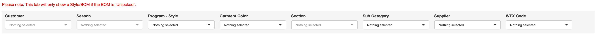

# Multiple BOM Editor

The multiple BOM editor tab functions in the same way as the [Bill of Materials] for individual Product IDs, with one major difference.

This tab allows to update multiple BOMs at the same time without having to open each Product ID one by one.

## Filters

Multiple BOM Editor tab allows the users to filter based on

{width='100%'}

1.  Customer
2.  Season
3.  Program - Style
4.  Garment Color
5.  Section
6.  Sub Category
7.  Supplier
8.  WFX Code

## Adding / Updating / Removing BOM Items

This functions in the same way as the Bill of Materials.

Please refer the documentation on the [Bill of Materials] page.
