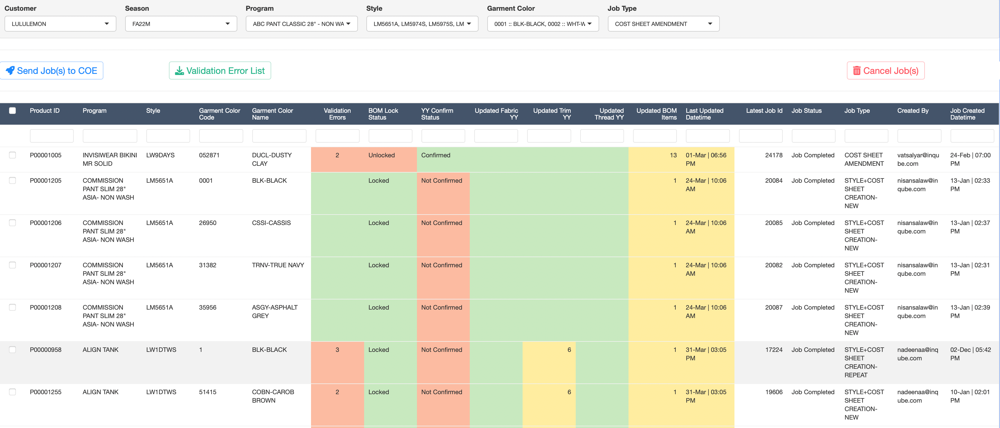

# COE Jobs

The COE Jobs tab on the main screen is designed to be able to send multiple Jobs to COE at a time with ease.

This tab allows to send 2 types of COE and is also used for getting a confirmation from the Cost Engineering team of having updated the Bulk YY.

1.  [Cost Sheet Amendment]
2.  [OC Creation]
3.  [YY Confirmation]

## How to Use

### Sending Job(s) to COE

To send Job(s) to COE team using this tab

1.  Select Customer
2.  Select Season
    -   This will populate the Program, Style and Garment Color drop-downs
3.  Select the Job Type
    -   This will populate a table on the screen
4.  Select the Product ID(s) for which to send Job to COE
5.  Click on the 'Send Job(s) to COE' button

This would create Jobs on the COE Job Tracker workflow application made with Microsoft O365 Power Apps.

### Cancelling Jobs

If the latest 'Cost Sheet Amendment' job against a Product ID is still in the 'Pending Approval' status in COE Job Tracker, then the job can be cancelled from this screen.

To Cancel Job(s) sent to COE Team

1.  Select Customer
2.  Select Season
    -   This will populate the Program, Style and Garment Color drop-downs
3.  Select the Job Type
    -   This will populate a table on the screen

    -   The table will show the Latest Job Id, Job Status, Job Type, Created By and Job Created Datetime columns

    -   A job will get cancelled only if the Job Status is 'Pending Approval'
4.  Select the Product ID(s) for which to cancel the last Job
5.  Click on the 'Cancel Job(s)' button

## Cost Sheet Amendment

Cost Sheet Amendment type of Jobs can be sent to COE using the COE Jobs tab. This basically sends Jobs to COE for updating the BOM in WFX.

Once Cost Sheet Amendment Job type is selected, the table on the screen will show like below.

{width="100%"}

### Columns on the Table

Each column on this table has its relevance and functionality, please refer below

1.  Product ID, Program, Style, Garment Color Code, Garment Color Name
    -   These columns are for user's reference to understand which Style each row represents
2.  Validation Errors
    -   This shows the number of BOM Pre-Validation Errors currently against each Product ID
3.  BOM Lock Status
    -   Shows whether the BOM is Locked or Unlocked as updated either from the [Product List] tab or from the [Bill of Materials]
4.  YY Confirm Status
    -   Shows whether the YY has been Confirmed or Not Confirmed by the Cost Engineering team
5.  Updated Fabric YY
    -   Shows the number of Fabric Line Items for which Bulk YY or Bulk Wastage was updated after sending the previous job to COE
6.  Updated Trim YY
    -   Shows the number of Trim Line Items for which Bulk YY or Bulk Wastage was updated after sending the previous job to COE
7.  Updated Thread YY
    -   Shows the number of Thread Line Items for which Bulk YY or Bulk Wastage was updated after sending the previous job to COE
8.  Updated BOM Items
    -   Shows the number of BOM Line Items for which anything was updated after sending the previous job to COE
9.  Last Updated Datetime
    -   Shows the Date & Time when the last update was done
10. Latest Job Id, Job Status, Job Type, Created By, Job Created Datetime
    -   Shows the details of the previous job sent to COE, for reference

### Validations before Sending Job to COE

The following points are validated within the screen before sending a job to COE. If any one of this conditions fails, then Job is not sent for that Product ID.

1.  Validation Errors must be Zero (0) or Blank

2.  BOM Lock Status must be 'Locked'

3.  YY Confirm Status must be 'Confirmed'

4.  Out of the 4 columns Updated Fabric YY, Updated Trim YY, Updated Thread YY and Updated BOM Items, at least one of the columns must have a number greater than Zero in it, meaning that there was actually an amendment done after the previously sent job

    -   This is to avoid sending jobs to COE with no amendments, hence wasting time and effort

## OC Creation

OC Creation type of Jobs can be sent to COE using the COE Jobs tab. This sends Jobs to COE for creating OCs in the WFX system.

Once OC Creation Job type is selected, the table on the screen will show like below.

{width="100%"}

### Columns on the Table

Each column on this table has its relevance and functionality, please refer below

1.  Product ID, Program, Style, Garment Color Code, Garment Color Name

    -   These columns are for user's reference to understand which Style each row represents

2.  Style Code Verified

    -   Shows either `<i class="fa fa-circle-check" role="presentation" aria-label="circle-check icon" style="color:green;"></i>`{=html} or `<i class="fa fa-circle-xmark" role="presentation" aria-label="circle-xmark icon" style="color:red;"></i>`{=html}

3.  Sizes Verified

    -   Shows either `<i class="fa fa-circle-check" role="presentation" aria-label="circle-check icon" style="color:green;"></i>`{=html} or `<i class="fa fa-circle-xmark" role="presentation" aria-label="circle-xmark icon" style="color:red;"></i>`{=html}

4.  New Orders

    -   Shows the number of Orders on the [Orderbook] tab newly created after sending the previous Job to COE

5.  Quantity

    -   Shows the Total Quantity of the newly created Orders

6.  Order Creation Datetime

    -   Shows the latest Created Datetime of the newly created Orders

7.  Latest Job Id, Job Status, Job Type, Created By, Job Created Datetime

    -   Shows the details of the previous job sent to COE, for reference

### Validations before Sending Job to COE

The following points are validated within the screen before sending a job to COE. If any one of this conditions fails, then Job is not sent for that Product ID.

1.  Style Code Verified must be `<i class="fa fa-circle-check" role="presentation" aria-label="circle-check icon" style="color:green;"></i>`{=html}

    -   Style Codes are updated by the COE team against the Style + Cost Sheet Creation jobs in the COE Job Tracker

    -   Once COE has updated, the Style Codes get automatically integrated to the SMF App

    -   It can take up to 30 minutes after Style + Cost Sheet creation job has been completed to get integrated

2.  Sizes Verified must be `<i class="fa fa-circle-check" role="presentation" aria-label="circle-check icon" style="color:green;"></i>`{=html}

    -   Sizes get verified between SMF Garment Size and WFX Sizes assigned against the above Style Code

    -   Normally, Sizes Verified will get integrated every day at around 5 am

    -   Hence, it can take up to the next day after a Style Code is created in WFX to integrate with the SMF App

3.  New Orders

    -   New Orders column must have a value greater than Zero, meaning that there was actually atleast 1 new Order created after the previously sent job

        -   This is to avoid sending Blank jobs to COE

## YY Confirmation

YY Confirmation is not really a COE Job, but rather a step provided for the Cost Engineering team to confirm that Bulk YY has been updated in the system, and Bulk / Development Merchants can proceed in sending the YY / Cost Sheet Amendment jobs to COE.

This additional step was provided to make it clear which Product IDs have been given a 'green light' by the Cost Engineering team during the Buy processing.

{width='100%'}

### Confirming YY Update

To Confirm YY Update, proceed as follows

1.  Select Customer
2.  Select Season
    -   This will populate the Program, Style and Garment Color drop-downs
3.  Select the Job Type as 'YY Confirmation'
    -   This option is only visible to the Cost Engineering team
4.  Select the Product ID(s) for which to Confirm YY
5.  Click on the 'Confirm YY Update' button

### Un-Confirming YY Update

To Un-Confirm YY Update, proceed as follows

1.  Select Customer
2.  Select Season
    -   This will populate the Program, Style and Garment Color drop-downs
3.  Select the Job Type as 'YY Confirmation'
    -   This option is only visible to the Cost Engineering team
4.  Select the Product ID(s) for which to Confirm YY
5.  Click on the 'Un-Confirm YY Update' button
