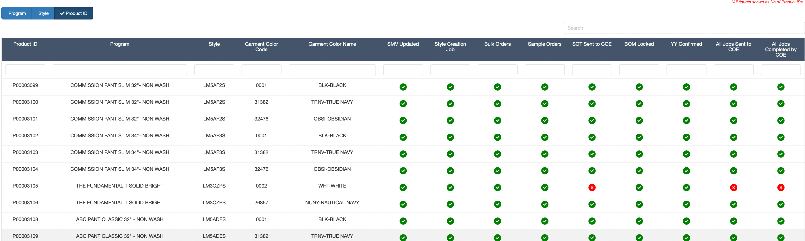

# Dashboard

Dashboard is designed to show a simple summary of the buy process completion.

{width="100%"}

From a buy process perspective, the following steps need to be followed. This tab allows the team to track the progress of each of the process steps.

1.  Product ID Creation - by Dev Merchant
2.  Chassis Code & SMV Update - by IE team
3.  Style Creation Job sending - by Dev Merchant to COE team
4.  Bulk Order Creation - by Bulk Merchant
5.  Sample Order Creation - by Bulk Merchant
6.  SOT Sending to COE - by Bulk Merchant
7.  Bulk YY Update & Confirmation - by Cost Engineering team
8.  Bulk YY Update Job sending to COE - by Bulk / Development Merchant
9.  Job Completion by COE team - COE Order Processing team

Pending tasks can be viewed in a table based on either Program, Style or Product ID.

{width="100%"}
