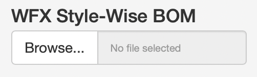
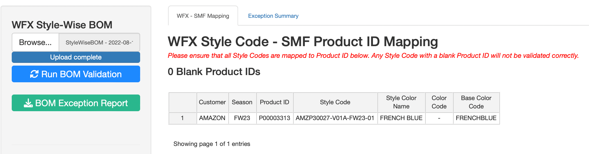

# WFX BOM Validation

[WFX BOM Validation](https://inqube.shinyapps.io/WFX-BOM-Validation/){target="_blank"} is a companion application to the Style Master File application.

The purpose of this application is to provide a functionality to compare the final WFX BOM with the SMF App BOM and show Exceptions, if any.

{width="100%"}

## BOM Validation

### How to Run Validation

To validate the WFX BOM against the SMF App BOM, please follow the steps as described below

1.  Log on to the WFX System and Download the BI report named 'StyleWiseBOM' for the relevant Style Code(s)

2.  Log on to the WFX BOM Validation application

3.  On the 'WFX Style-Wise BOM' upload option, upload the WFX excel file as-is

    -   Please do not modify the WFX downloaded file before uploading

        {width="25%"}

4.  Once the file has been uploaded, on the 'WFX - SMF Mapping' tab, a table will appear showing the mapping between the WFX Style Code and the SMF Product ID

    

5.  Check the Style Code - Product ID mapping and correct it if necessary

6.  Click on the 'Run BOM Validation' button

7.  Once the Validation Run has completed, download the Exception Report by clicking on the 'BOM Exception Report' button.

### Exception Report Content

The downloaded Exception report consists of the following sheets

1.  Summary

    Each row in the Summary sheet represents 1 Style Code, showing how many exceptions are found for the Style Code

2.  Exceptions

    -   Each row on the Exceptions sheet represents 1 BOM Line Item and shows the comparison between WFX and SMF for the line Item

    -   For each of the field compared, this sheet shows the WFX value and the SMF Value

    -   If there is any exception / variation found, then the field name in which the exception was identified is mentioned inside the 'Exception Comments' column

    -   If a BOM Line Item does not have any exception, it will not get listed on this report

3.  Exceptions - Process Items

    -   Exceptions - Process Items sheet functions in the same way as the Exceptions sheet mentioned above, but only for 'Process Items'

4.  On SMF - Missing in WFX

    -   If a BOM Line item is found on SMF BOM, but was missing from the WFX BOM, that will get listed here

5.  On WFX - Missing in SMF

    -   If a BOM Line item is found on WFX BOM, but was missing from the SMF BOM, that will get listed here

6.  SMF Items - Not Validated

    -   If there are any BOM Line items on the SMF BOM, which do not have a unique combination of Body Type & WFX Code
    -   Such items cannot be joined to compare and hence need to be verified manually

7.  WFX Items - Not Validated

    -   If there are any BOM Line items on the WFX BOM, which do not have a unique combination of Body Type & WFX Code

    -   Such items cannot be joined to compare and hence need to be verified manually

### Validation Logic

#### Join Combinations

The application tries to match SMF BOM items with the WFX BOM items based on 5 columns. Since there can be errors even on one of these columns, the application tries to join the tables in 4 steps, removing one of the columns in each step and only considering the un-joined rows for the step

-   Body Type, Article Code, Article Color Code, Item Size, Garment Size

-   Body Type, Article Code, Article Color Code, Item Size

-   Body Type, Article Code, Article Color Code

-   Body Type, Article Code

At a bare minimum, the Body Type and Article Code combination must form a unique key.

#### Variances

After each join step, the 'joined' row outputs are combined into a single data frame and checked for variances on the following columns between WFX and SMF BOMs

-   Article Color Code

-   Item Size

-   Cons / Bulk YY

-   Wastage

-   Supplier

-   Delivery Terms

-   Price

-   Shipment Mode

-   Purchase Officer

-   Garment Size

-   Destination

For 3 of the above columns, the matching is done using [Jaccard Similarity](https://en.wikipedia.org/wiki/Jaccard_index) instead of using an exact match.

-   Supplier - minimum 90% match required

-   Delivery Terms - minimum 75% match required

-   Purchase Officer - minimum 75% match required

Any variances found are added to the Exception Comments column.

### Data Saving - AWS S3

Every time Validation is run, on AWS S3 under the folder 'SMF/BOM Validation', the following files are updated

1.  Exceptions.parquet
2.  Exceptions_Process_Items.parquet
3.  Missing_In_WFX.parquet
4.  Additional_In_WFX.parquet
5.  BOM_Validation_Log.parquet

On files 1 - 4 above, only the latest Validation run per Style Code is recorded. Hence, if a user runs validation 5 times for the same Style Code, only the results of the 5th execution will get saved.

For file 5, log is recorded for every single run, hence just registering a time-stamp against a user, primarily to identify how many times Validation is being executed for a single Style Code.

## Style Validation

Similar to the BOM Validation, the application also allows users to validate the [Product List] details against WFX.

### How to Run Validation

To validate the WFX Style Details against the SMF Product List, please follow the steps as described below

1.  Log on to the WFX System and Download the BI report named 'Style Article Status Report' for the relevant Style Code(s)

2.  Log on to the WFX BOM Validation application

3.  On the 'WFX Style Detail Report' upload option, upload the WFX excel file as-is

    -   Please do not modify the WFX downloaded file before uploading

4.  Once the file has been uploaded, Click on the 'Run Style Validation' button

5.  Once the Validation Run has completed, download the Exception Report by clicking on the 'Style Exception Report' button.

### What Will get validated?

The following columns will get validated for all the Style Codes uploaded for validation

-   Customer
-   Buyer Department
-   Material Type
-   Article Description
-   Product Group
-   Sub Category
-   Season
-   Style
-   Gender
-   Selling Price
-   Internal Style Ref
-   Garment Color Code
-   Garment Color Name
-   WFX Color Code / Base Color Code
-   Program
-   Sub Con Type
-   Chassis Code
-   SMV Pre
-   SMV Sewing

Few points to note:

-   Numeric fields will be rounded off to 4 decimal places before comparing

-   String / character fields will be converted to lower case before matching

-   For string / character fields, extra spaces will be removed before matching

### Data Saving - AWS S3

Every time Validation is run, on AWS S3 under the folder 'SMF/BOM Validation', the following files are updated

1.  Style_Validation_Detail.parquet
2.  Style_Validation_Log.parquet

For 'Style_Validation_Detail', only the latest Validation run per Style Code is recorded. Hence, if a user runs validation 5 times for the same Style Code, only the results of the 5th execution will get saved.

For 'Style_Validation_Log', log is recorded for every single run, hence just registering a time-stamp against a user, primarily to identify how many times Validation is being executed for a single Style Code.

## User Access

For access, there is a SharePoint list named 'ShinyApps User Access' under the 'COE Operations' sub-site.

On the said list, a user must be added and the following column must be updated

1\. WFX BOM Validation

-   Yes or No

Based on the access levels defined on this SharePoint list, once a day a script within the 'Data Processing' project on the server adds or removes users from the [WFX BOM Validation](https://inqube.shinyapps.io/WFX-BOM-Validation/){target="_blank"} application on shinyapps.io

-   25_Shiny User Access.R

The above script specifies whether a user has access to the application or not. There are no custom access levels, if a user has access, they can run validation.
