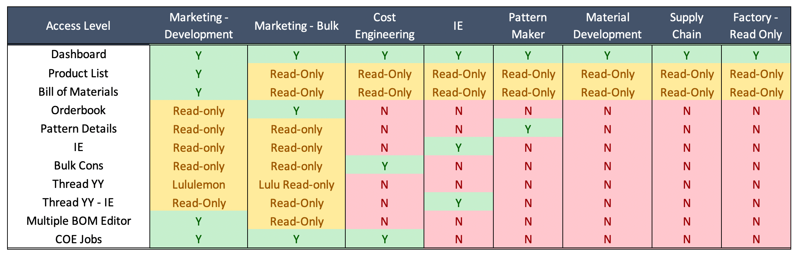

# Administration

## User Access Levels

The following Access Levels have been defined on the SMF App.

1.  Customer Level Access
2.  Department Level Access

### Customer Level Access

Customer Level access ensures that users can only access specific Customer accounts. Each user can be assigned single or multiple Customer account access.

### Department Level Access

The following Department Level access levels exist in the system

1.  Marketing - Development
2.  Marketing - Bulk
3.  Cost Engineering
4.  IE
5.  Pattern Maker
6.  Material Development
7.  Supply Chain
8.  Factory - Read Only

Please see the below grid for reference

{width="100%"}

### BOM Unlock Access

BOM Unlock access can be given separately to any of the Marketing users. Originally it was agreed to give this access to only 1 senior Bulk Merchant per Customer to control the process. For Lulu and Decathlon, due to the size of the Business, more than 1 Bulk Merchants have access to Unlock BOMs.

### How to Define / Update / Change Access Levels

For access, there is a SharePoint list named 'ShinyApps User Access' under the 'COE Operations' sub-site.

On the said list, a user must be added and the following SMF related columns can be updated

1.  SMF
    -   Yes or No
2.  SMF Department
    -   Update the Department here
3.  SMF Role
    -   Update the Role here, normally same as Department, except for when Department is Marketing
4.  SMF Customer
    -   Update the Customer names for which User must have access

    -   Customer name should be exactly same as SMF App

    -   Multiple Customer Names must be separated by semicolon (;)
5.  SMF BOM Unlock
    -   Yes or No

Based on the access levels defined on this SharePoint list, once a day a script within the 'Data Processing' project on the server adds or removes users from the Style-Master-File application on shinyapps.io

-   25_Shiny User Access.R

The above script only specifies whether a user has access to the application or not. It does not define the level of access for the user.

Whenever a User logs on to the SMF App, the application executes a SP REST API call to the 'ShinyApps User Access' SP List to check and set the User Access for each session in real-time.

## Integration / Dependencies

SMF App has a few dependencies as listed below

### Integration with AWS S3

The entire database for this application is hosted within a S3 bucket on the following folder inqube-stylesmaster \> InQube-Insights \> SMF

Access keys required for the accessing the S3 bucket are saved within a config.rds file inside the 'data' folder of the application.

### Integration with Share Point

To send / update COE Jobs, the application connects to the 'COE Operations' sub-site on Share Point using the SP REST API.

Access keys / credentials required for the accessing the SP REST API are saved within a config.rds file inside the 'data' folder of the application.

### SMF Drop-down Master

Under the SMF folder on S3, there is a file named 'Drop_Master.parquet'. This file gets updated on an hourly schedule.

The script to update this file is on the 'Data Processing' project running on the On-Prem server in Ranala

-   5002_Update SMF Dropdown Master.R

### WFX Item Master

Under the SMF folder on S3, there are the following files.

-   Item_Master.parquet - For RM Items

-   Item_Master_AP.parquet - For Apparel Style Codes

-   Item_Master_Colors.parquet - For RM Items with Color

These files get updated on an hourly schedule. The script to update the Item Master is on the 'Data Processing' project running on the On-Prem server in Ranala

-   5001_Update Item Master.R

### WFX Buyer Department Master

Under the Dashboard-Datasets folder on S3, there is a file named

-   WFX_MST_Buyer_Department.parquet

This file gets updated once a day in the morning. The script to update the Item Master is on the 'Data Processing' project running on the On-Prem server in Ranala

-   32_Master Files.R

### WFX Supplier Master

Under the Dashboard-Datasets folder on S3, there is a file named

-   WFX_MST_Suppliers.parquet

This file gets updated once a day in the morning. The script to update the Item Master is on the 'Data Processing' project running on the On-Prem server in Ranala

-   32_Master Files.R

### WFX Style Color Size

Under the Dashboard-Datasets folder on S3, there is a file named

-   WFX_MST_Style_Color_Size.parquet

This file gets updated once a day in the morning. The script to update the Item Master is on the 'Data Processing' project running on the On-Prem server in Ranala

-   5001_Update Item Master.R
